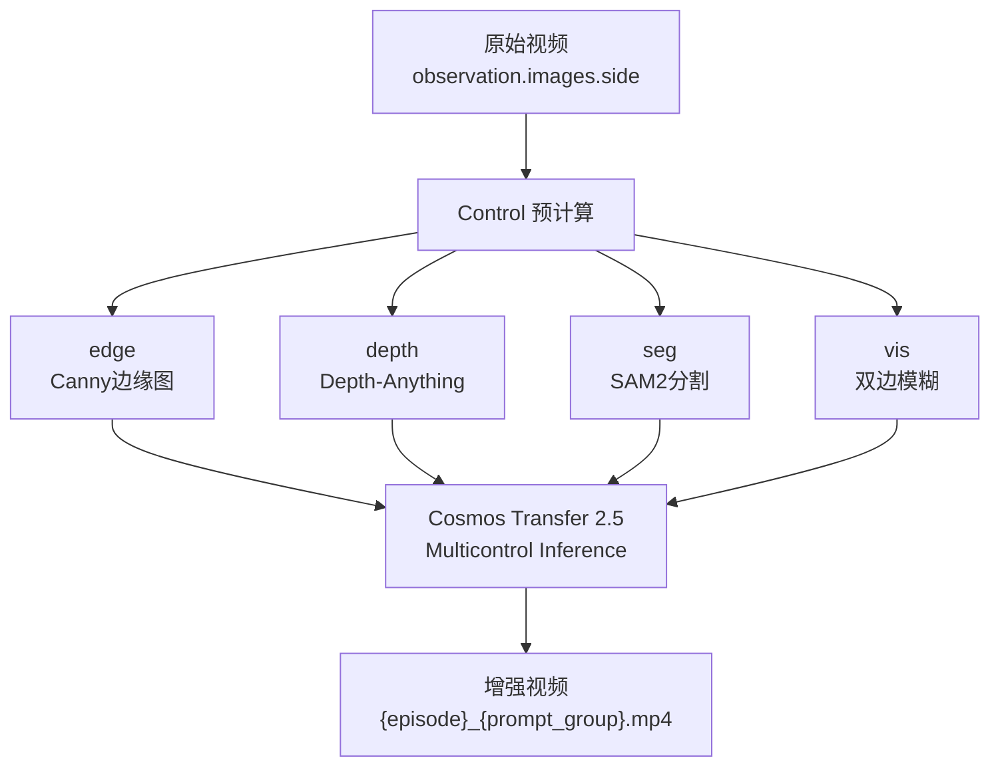

# LeRobot 数据集增强流程

将 LeRobot 录制的数据经过切分、增强、集成，生成可用于训练的数据集。

## 目录

- [前置准备](#前置准备)
- [Stage 1：切分数据集](#stage-1切分数据集)
- [Stage 2：增强数据生成](#stage-2增强数据生成)
- [Stage 3：集成到训练集](#stage-3集成到训练集)
- [训练验证](#训练验证)

---

## 前置准备

### 环境依赖

```bash
pip install pandas pyarrow numpy torch torchvision opencv-python ffmpeg-python imageio imageio-ffmpeg
```

### 目录布局

```
cosmos-transfer2.5/
├── lerobot/
│   └── seeed_rebot_b601_dm/
│       └── organize_test_tube/        # 原始 LeRobot 数据集
│           ├── meta/
│           │   ├── info.json           # schema 定义
│           │   └── stats.json         # 统计信息
│           ├── data/                   # parquet 数据（.parquet 文件）
│           │   └── chunk-000/
│           │       └── file-000.parquet
│           └── videos/                # 原始视频
│               └── observation.images.front/
│               └── observation.images.side/
├── datasets/
│   └── test_tube_30s/                # 切分后的 30s episode
│       ├── manifest.csv               # episode 索引
│       ├── observation.images.front/
│       │   ├── episode-000_...mp4
│       │   └── ...
│       ├── observation.images.side/
│       └── controls/                  # 中间控制视频
│           └── {episode}/
├── outputs/                          # 增强输出（保留controls）
└── scripts/
    ├── split_dataset_30s.py          # Stage 1
    ├── lerobot_side_augment.py       # Stage 2
    └── integrate_augmented_lerobot.py # Stage 3
```

---

## Stage 1：切分数据集

### 目标

将 LeRobot 录制的长视频（通常数分钟）切分为固定时长的 episode，每个 episode 包含多个相机视角的视频切片，并生成 `manifest.csv` 索引文件。

### 工作原理

`scripts/split_dataset_30s.py` 使用 ffmpeg 无损切割（`-c copy`），按固定 `CHUNK_DURATION=30s` 切分。每个 episode 同时切割所有相机视角的视频，保证时间同步。

### 输入

```
lerobot/seeed_rebot_b601_dm/organize_test_tube/videos/
├── observation.images.front/chunk-000/file-000.mp4   # 原始长视频
└── observation.images.side/chunk-000/file-000.mp4
```

### 配置脚本

编辑 `scripts/split_dataset_30s.py` 顶部的路径和参数：

```python
ROOT = Path("/path/to/cosmos-transfer2.5")
INPUT_DIR = ROOT / "lerobot/seeed_rebot_b601_dm/organize_test_tube/videos"
OUTPUT_DIR = ROOT / "datasets/test_tube_30s"
CHUNK_DURATION = 30.0          # 每个 episode 的时长（秒）
CAMERAS = ["observation.images.front", "observation.images.side"]
SOURCE_FILES = ["file-000.mp4", "file-001.mp4"]
```

### 运行

```bash
cd /home/seeed/workspace/cosmos-transfer2.5
source .venv/bin/activate
python scripts/split_dataset_30s.py
```

### 输出

```
datasets/test_tube_30s/
├── manifest.csv
├── observation.images.front/
│   ├── episode-000_file-000_0-30s.mp4
│   ├── episode-001_file-000_30-60s.mp4
│   └── ...
└── observation.images.side/
    └── ...
```

### manifest.csv 格式

| 列名 | 说明 | 示例 |
|------|------|------|
| `episode` | Episode 唯一标识 | `episode-000_file-000_0-30s` |
| `camera` | 相机名称 | `observation.images.front` |
| `source_file` | 来源文件 | `file-000.mp4` |
| `start_sec` | 开始时间（秒） | `0.0` |
| `end_sec` | 结束时间（秒） | `30.0` |
| `frame_count` | 帧数 | `900` |
| `is_remainder` | 是否为末尾余数 | `no` |
| `augmented_path` | 增强后视频路径（Stage 2 后填充） | 空或路径 |
| `augmented_fps` | 增强视频帧率 | `30.1` |

> `episode` 命名格式：`episode-{idx}_file-{file_index}_{start}-{end}s[_remainder]`
>
> `file_index` 从 0 开始，对应 `SOURCE_FILES` 列表中的索引。

---

## Stage 2：增强数据生成

### 目标

使用 Cosmos Transfer 2.5 视频生成模型，在原始视频的基础上生成多视角、多风格的增强版本（side view synthesis、风格迁移等），扩大数据集多样性。

### 工作原理

`scripts/lerobot_side_augment.py` 对每个 episode 执行以下流程：



每个 episode 随机选择一个 prompt group（`group_a` / `group_b` / `group_c` / `group_d`），对应不同的生成描述，生成风格略有不同的结果。

### Prompt 位置

```
assets/lerobot_example/prompts/
├── group_a/
│   ├── front.txt
│   └── side.txt
├── group_b/
├── group_c/
└── group_d/
```

### 运行命令

```bash
# 全量运行（所有 episode、所有相机、所有控制信号）
python scripts/lerobot_side_augment.py --mode multicontrol

# Flash Attention 加速（NVIDIA Thor GPU）
COSMOS_USE_FLASH_ATTN=1 python scripts/lerobot_side_augment.py --mode multicontrol

# 仅侧视角，仅 edge 控制
python scripts/lerobot_side_augment.py --mode edge --cameras side

# 断点续传（跳过已有输出的 episode）
python scripts/lerobot_side_augment.py --mode multicontrol --resume

# 仅处理前 2 个 episode
python scripts/lerobot_side_augment.py --mode multicontrol --limit 2

# 指定 depth encoder
python scripts/lerobot_side_augment.py --mode multicontrol --depth_encoder vitl
```

### 参数说明

| 参数 | 默认值 | 说明 |
|------|--------|------|
| `--mode` | `multicontrol` | `edge` 仅边缘控制；`multicontrol` 包含 depth+edge+seg+vis |
| `--cameras` | `front,side` | 要处理的相机（逗号分隔） |
| `--controls` | `edge,depth,vis,seg` | 要预计算的控制信号类型 |
| `--resume` | False | 跳过已有输出的 episode |
| `--limit` | 0（无限制） | 最多处理 N 个 episode |
| `--seed` | 时间随机 | 固定随机种子以复现 prompt group 选择 |
| `--depth_encoder` | `vits` | Depth-Anything 编码器：`vits`（轻量）或 `vitl`（高精度） |
| `--seg_prompt` | `robot arm gripper test tube rack laboratory` | SAM2 分割提示词 |

### 输出

```
datasets/test_tube_30s/
├── manifest.csv                        # augmented_path 列已填充
├── observation.images.side/
│   ├── episode-000_file-000_0-30s_group_a.mp4   # 增强视频
│   └── ...
└── controls/                           # 中间控制视频（可复用）
    └── {episode}/
        └── {camera}/
            ├── edge.mp4
            ├── depth.mp4
            ├── seg.mp4
            └── vis.mp4
```

### 增强视频命名规则

`{episode}_{prompt_group}.mp4`，例如：
- `episode-000_file-000_0-30s_group_a.mp4`
- `episode-001_file-000_30-60s_group_c.mp4`

`prompt_group` 随机选择，记录在控制台输出中。如果需要固定某个 group，可通过修改脚本随机种子或直接指定。

---

## Stage 3：集成到训练集

### 目标

将增强后的视频片段与原始 LeRobot 数据集中的关节状态/action 数据对齐，生成符合 LeRobot 训练格式的数据集目录。

### 关节数据说明

每个 parquet 行包含 7 个关节的位置数据：

| 关节名 | 说明 |
|--------|------|
| `shoulder_pan.pos` | 肩部旋转 |
| `shoulder_lift.pos` | 肩部抬升 |
| `elbow_flex.pos` | 肘部弯曲 |
| `wrist_flex.pos` | 腕部弯曲 |
| `wrist_yaw.pos` | 腕部偏航 |
| `wrist_roll.pos` | 腕部滚动 |
| `gripper.pos` | 夹爪位置 |

action 与 observation.state 使用相同的 7 维向量，只是语义不同（action 是预测目标，state 是观测值）。

### manifest 到 parquet 的映射

manifest 中的 episode 名称通过以下规则映射回原始 parquet 数据：

```
episode-000_file-000_0-30s  →  file-000.mp4  →  chunk-000/file-000.parquet
episode-009_file-001_0-30s  →  file-001.mp4  →  chunk-000/file-001.parquet
```

`file_index` 从文件名中提取（如 `file-000` → `0`），`chunk_index` 始终为 0。

### 配置脚本

编辑 `scripts/integrate_augmented_lerobot.py` 顶部的路径：

```python
# 原始 LeRobot 数据集（需要 parquet 数据文件）
ORIGINAL_LEROBOT_ROOT = Path("/path/to/lerobot/seeed_rebot_b601_dm/organize_test_tube")
# 增强后的 30s episode 数据
AUGMENTED_DATASET_ROOT = Path("/path/to/datasets/test_tube_30s")
# 输出目录
OUTPUT_ROOT = Path("/path/to/output/seeed_rebot_b601_dm")
```

原始 LeRobot 数据集目录结构应为：

```
ORIGINAL_LEROBOT_ROOT/
├── meta/
│   ├── info.json
│   └── stats.json
├── data/
│   └── chunk-000/
│       ├── file-000.parquet   # 每行包含 action、observation.state、时间戳等
│       └── file-001.parquet
└── videos/
    └── observation.images.front/side/
```

### 运行

```bash
python scripts/integrate_augmented_lerobot.py
```

### 输出目录结构

```
OUTPUT_ROOT/
├── meta/
│   ├── info.json           # schema 定义
│   ├── stats.json          # 重新计算的统计信息
│   ├── episodes.jsonl      # 每个 episode 的帧数索引
│   └── modality.json       # 模态配置
├── data/
│   └── chunk-000/
│       ├── file-000.parquet  # 增强 episode 的 parquet 数据
│       └── file-001.parquet
└── videos/
    └── observation.images.front/
        └── chunk-000/
            ├── file-000.mp4  # 原始视频（硬链接）
    └── observation.images.side/
        └── chunk-000/
            ├── file-000.mp4  # 增强视频（复制）
```

### 关键设计

**1. Parquet 数据不重复** — 增强仅改变了视频帧，关节/动作数据完全复用原始数据。脚本从原始 parquet 中按时间戳范围筛选对应帧的数据，写入新的 parquet 文件。

**2. 视频路径存储为相对路径** — parquet 中的 `observation.images.{camera}` 列存储相对路径（如 `../videos/observation.images.side/chunk-000/file-000.mp4`），数据加载器会根据 parquet 所在目录解析为绝对路径。

**3. 统计信息自动重新计算** — 输出 `meta/stats.json` 包含所有增强 episode 的 action / observation.state 的 min、max、mean、std、q01-q99，与 LeRobot 训练流程兼容。

**4. 仅集成已增强的 episode** — manifest 中 `augmented_path` 为空的 episode 不会被集成，原始数据完整保留。

---

## 训练验证

数据集生成后，使用 LeRobot CLI 验证：

```bash
lerobot雅的 /path/to/output/seeed_rebot_b601_dm

# 或者通过 Python API
python -c "
from lerobot.common.datasets.lego_robot_dataset import LeRobotDataset
ds = LeRobotDataset('/path/to/output/seeed_rebot_b601_dm')
print(f'Episodes: {ds.num_episodes}')
print(f'Total frames: {ds.num_samples}')
print(f'Features: {list(ds.features.keys())}')
item = ds[0]
print(f'Action shape: {item[\"action\"].shape}')
"
```

如需与原始数据合并训练，可将两个数据集目录合并 parquet 文件，或使用 LeRobot 的多数据集加载功能。
